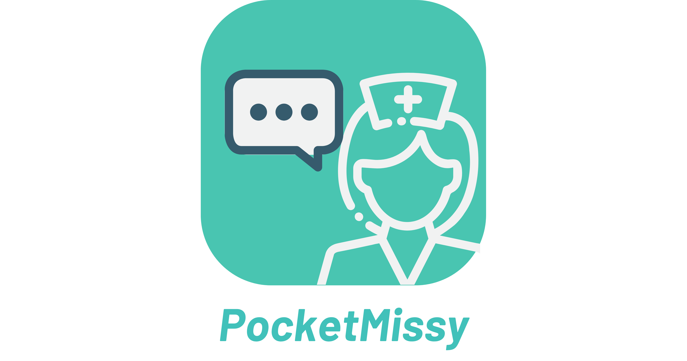
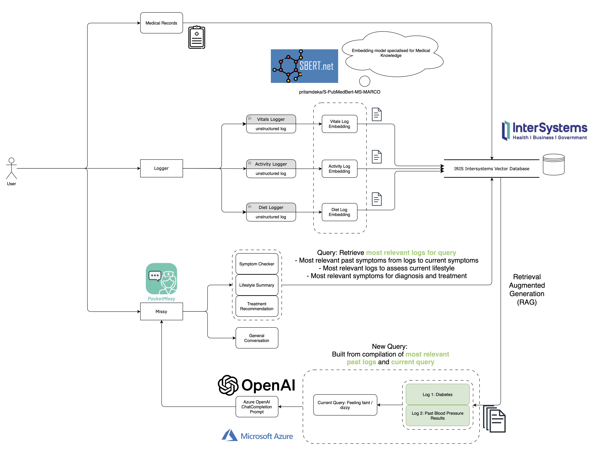

# HealthHack: Pocket Missy



## Overview

Welcome to **Pocket Missy**, an innovative all-in-one app built to advance value-based healthcare in Singapore and support seniors in living independently. 

By unifying essential healthcare services into one powerful platform, Pocket Missy leverages cutting-edge vector search and Retrieval-Augmented Generation (RAG) technology to deliver hyper-personalized medical advice. Beyond that, it provides advanced data analytics and actionable healthcare insights, empowering users to make smarter, data-driven decisions for their health.


---

<!-- ## Table of Contents

<<<<<<< HEAD
1. [Overview](#overview)
2. [Problem Statement & Context](#problem-statement--context)
3. [Our Approach](#our-approach)
4. [Key Features](#key-features)
5. [Architecture & Workflow](#architecture--workflow)
6. [Setup & Installation](#setup--installation)
7. [Usage](#usage)
8. [APIs & Data Flow](#apis--data-flow)
9. [Code Samples](#code-samples)
10. [Screenshots & Visuals](#screenshots--visuals)
11. [Contributing](#contributing)
12. [License](#license)
13. [Final Thoughts](#final-thoughts) -->
=======
1. [Overview](#1-overview)
2. [Problem Statement & Context](#2-problem-statement--context)
3. [Our Approach](#3-our-approach)
4. [Key Features](#4-key-features)
5. [Architecture & Workflow](#5-architecture--workflow)
6. [Setup & Installation](#6-setup--installation)
7. [Usage](#7-usage)
8. [APIs & Data Flow](#8-apis--data-flow)
9. [Code Samples](#9-code-samples)
10. [Screenshots & Visuals](#10-screenshots--visuals)
11. [Contributing](#11-contributing)
12. [License](#12-license)
13. [Final Thoughts](#13-final-thoughts)
>>>>>>> readme


## Problem Statement & Context


1. **Fragmented Healthcare Ecosystem:**  
   The current healthcare landscape is cluttered with multiple disjointed apps for appointments, prescriptions, teleconsultations, and medical records. This fragmentation makes it difficult for users — especially seniors — to manage their health holistically and conveniently.

2. **Underreporting Among Seniors:**  
   Elderly users often underreport symptoms or health events, either due to forgetfulness or the complexity of navigating multiple healthcare platforms. This leads to missed opportunities for timely intervention and preventive care.

3. **Strain on the Healthcare System:**  
    Clinicians are frequently overwhelmed, having to comb through extensive medical records, lifestyle data, and dietary habits to make informed decisions. In reality, time constraints often prevent doctors from fully leveraging this data, resulting in rushed or incomplete diagnoses.

### Core Questions:

- **How can technology bridge the gap between elderly care services and healthcare providers to ensure continuous, value-based care while reducing costs?**
- **What innovative digital tools can lower healthcare costs and improve care quality in a value-based system?**

---

## 3. Our Approach

Our solution directly tackles these challenges through:

- **Unified Platform:**  
  A one-stop shop app where users log vitals, activities, and diet in a single interface—eliminating the need for multiple apps.

- **Personalized Multi-Language Chatbot ("Ask Missy"):**  
  A medical-tuned, AI-powered chatbot that accesses personal health records to deliver tailored advice. For instance, it can flag critical events like a persistent cough in patients with a history of lung cancer or log falls automatically for clinician review.

- **Data-Driven Insights & AI Analytics:**  
  Leveraging advanced AI, our platform processes sensor data and user inputs to monitor consumption and fitness patterns, providing personalized recommendations and enabling proactive care.

- **Advanced Data Retrieval Using IRIS & RAG:**  
  We use vector search in our IRIS database combined with Retrieval-Augmented Generation (RAG) to prompt engineer our requests to Azure OpenAI—ensuring that responses are contextually relevant and data-driven.

---

## 4. Key Features

- **Comprehensive Health Dashboard:**  
  View real-time vitals, activity logs, diet information, and medical records in one place.

- **"Ask Missy" Chatbot:**  
  - **Symptom Checker:** Analyzes symptoms using historical health data.
  - **Medical Summary:** Retrieves and synthesizes vitals and activity data.
  - **Treatment Recommendations:** Offers tailored advice based on individual health profiles.
  - **General Health Queries:** Supports multi-language conversations for accessible health information.

- **AI-Driven Data Embedding:**  
  Utilizes the SentenceTransformer model (`pritamdeka/S-PubMedBert-MS-MARCO`) to generate embeddings for medical records, enhancing search and retrieval capabilities.

- **Proactive Health Monitoring:**  
  Automatically logs critical health events and integrates multiple data sources to reduce underreporting and ensure comprehensive data is available to healthcare providers.

---

## 5. Architecture & Workflow

### Architecture



Powered by

- **Frontend (React Native):** 


  Delivers the mobile interface for the health dashboard and chatbot.

- **Backend (Flask):** 

  Provides RESTful API endpoints to interact with the IRIS database and Azure OpenAI.

- **Database (IRIS):**  
  Stores user data across tables: MedicalRecords, Vitals, Activity, PastPrompts, and Diet.  
  Utilizes vector search to support efficient data retrieval and prompt engineering.

- **Embedding Service:**  
  Generates semantic embeddings using SentenceTransformer for advanced natural language processing.

### Workflow

1. **Data Ingestion:**  
   Sensor data, user logs, and external information are stored in the IRIS database.
2. **Data Processing:**  
   The backend cleans and enriches the data, including generating embeddings.
3. **AI-Powered Insights:**  
   The chatbot uses contextual data (e.g., vitals, activities) to generate personalized responses via Azure OpenAI.
4. **User Interaction:**  
   Users engage with a unified mobile app that integrates real-time dashboards and a conversational AI interface.

---

## 6. Setup & Installation
### 1. Clone the Repository
```bash
git clone https://github.com/your-username/healthhack.git
cd healthhack
```
### 2. Installing depandencies
```bash
pip install -r requriements.txt
```

### 3. Running backend
```bash
python database.py

# populating database
python populate.py
```

### 4. Running Frontend
```bash
cd krr
# Add Azure API key
npm run android or npm run ios
```
